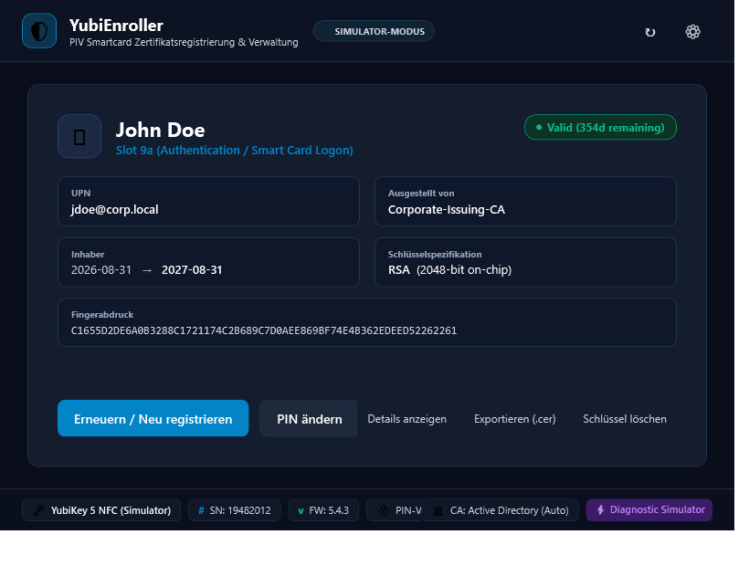
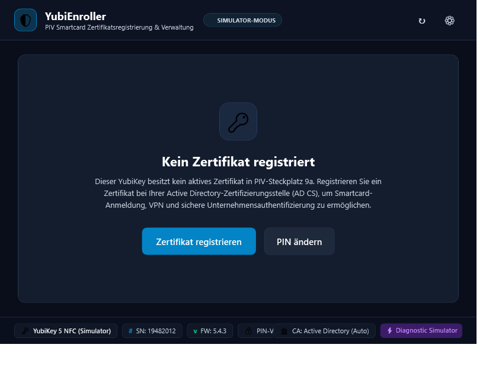
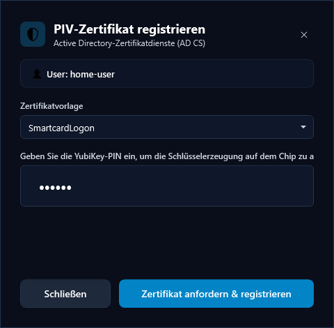
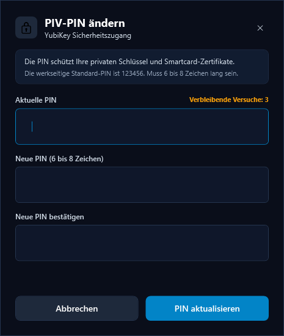
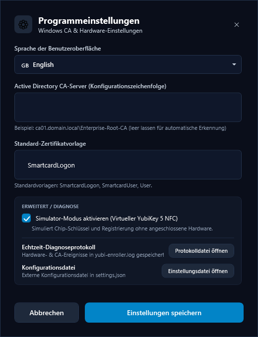
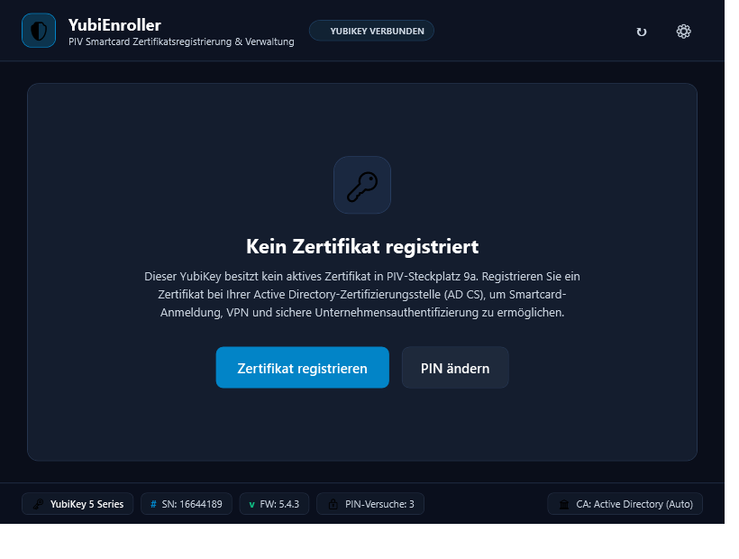

# YubiEnroller

<p align="center">
  
</p>

<p align="center">
  <strong>Modern, standalone Windows desktop application for YubiKey PIV credential management and Windows Active Directory Certificate Services (AD CS) enrollment.</strong>
</p>

<p align="center">
  <a href="https://github.com/npuee/yubi-enroller"></a>
  
  
  
  
  
</p>

---

## Overview

**YubiEnroller** enables enterprise organizations to streamline the deployment of **YubiKey Smart Card Logon** credentials to end users without requiring complex scripts, third-party middleware, or external runtimes.

Built with **C# / .NET 8 (WPF)** and the official **Yubico.YubiKey SDK**, YubiEnroller compiles down to a **zero-dependency, standalone native Windows executable (`YubiEnroller.exe`)**. It runs out-of-the-box on standard corporate workstations without needing Python, administrative software installers, or pre-installed .NET runtimes.

---

## Screenshots

### 1. Active Certificate Enrolled (Slot 9a)
Displays real-time hardware telemetry, enrolled user identity, certificate expiration status pill, and quick actions.

<p align="center">
  
</p>

---

### 2. Ready to Enroll / Empty State
When a YubiKey is inserted with no authentication certificate in Slot 9a, users are greeted with a clear call-to-action to enroll or update their PIN.

<p align="center">
  
</p>

---

### 3. Streamlined CA Enrollment Dialog
Designed for non-technical users. Automatically detects active Windows identity, loads enterprise certificate templates from `settings.json`, and hides cryptographic complexity.

<p align="center">
  
</p>

---

### 4. PIN Management Dialog
Securely change YubiKey PIV PIN with attempt counter protection against lockouts, validation feedback, and clear success confirmation.

<p align="center">
  
</p>

---

### 5. Settings & Diagnostics Dialog
Configure language, Windows CA server string, and open log or configuration files. Simulator mode is safely tucked away under an advanced diagnostics section.

<p align="center">
  
</p>

---

### 6. No Device Connected State
Real-time USB insertion/removal monitoring informs the user when a token is disconnected.

<p align="center">
  
</p>

---

## Key Features

- **Hardware PIV Slot 9a (Authentication) Inspection**:
  - Automatically queries and displays active X.509 certificate metadata:
    - Subject Common Name (CN) and User Principal Name (UPN)
    - Issuing Certificate Authority (CA)
    - Validity Range with dynamic status indicator (e.g. `● Valid (354d remaining)`)
    - Key algorithm and bit length (e.g. RSA 2048-bit on-chip)
    - SHA-256 Thumbprint and Serial Number
  - Export public certificate directly as `.cer` (DER format).
  - View full cryptographic certificate details modal.

- **Enterprise Windows CA Certificate Enrollment**:
  - **On-Token Key Generation**: Private keys are generated directly on the YubiKey PIV secure element and never leave the hardware token.
  - **Standard PKCS#10 CSR**: Constructs an industry-standard CSR with UPN Subject Alternative Name (SAN) and Smart Card Logon Enhanced Key Usages (EKU).
  - **Active Directory CA Integration**: Submits CSRs via `certreq.exe` to enterprise Windows CAs and writes the issued certificate directly into PIV Slot 9a.
  - **Factory Default PIN (`123456`) Guard**: If a user attempts to enroll with the factory default PIN, enrollment is blocked and the user is prompted to set a personal PIN first.

- **PIN Lifecycle Management**:
  - Update user PIV PIN with real-time retry count tracking (prevents accidental card lockout).
  - Enforces length requirements (6–8 digits/characters) and matching confirmation.
  - Immediate visual feedback on success or failure.

- **Status Bar Telemetry**:
  - Real-time hardware information: **Model** (`YubiKey 5 NFC`), **Serial Number** (`SN: 19482012`), **Firmware Version** (`FW: 5.4.3`), and **Remaining PIN Retries**.

- **Multi-Language GUI Localization**:
  - Dynamic on-the-fly language switching (no restart required) across all views and dialogs.
  - Ships with 6 languages:
    - 🇬🇧 **English** (`en`)
    - 🇪🇪 **Estonian / Eesti** (`et`)
    - 🇩🇪 **German / Deutsch** (`de`)
    - 🇫🇷 **French / Français** (`fr`)
    - 🇪🇸 **Spanish / Español** (`es`)
    - 🇱🇹 **Lithuanian / Lietuvių** (`lt`)
  - Easily extensible: simply drop any new `<code >.json` into the `locales/` directory.

- **External Configuration (`settings.json`)**:
  - Shipped directly alongside `YubiEnroller.exe`.
  - Hot-reloaded whenever dialogs open, allowing administrators to modify configurations without restarting the app.

- **Diagnostics Logging (Off by Default)**:
  - High-performance, thread-safe logger writing to `yubi-enroller.log`.
  - **Disabled by default** to keep production environments clean and eliminate disk I/O.
  - **Can only be toggled via `settings.json`** (`"EnableLogging": true`), preventing standard users from changing logging behavior in the UI.

- **Built-in Hardware Simulator**:
  - Allows full demonstration, testing, and UI preview without requiring physical YubiKey hardware or an Active Directory domain controller.
  - Safely located under **Settings > Advanced / Diagnostics**.

---

## Configuration (`settings.json`)

The application settings file resides right next to `YubiEnroller.exe`:

```json
{
  "Language": "en",
  "CaConfigString": "",
  "CertificateTemplate": "SmartcardLogon",
  "CertificateTemplates": [
    "SmartcardLogon",
    "SmartcardUser",
    "User",
    "ClientAuth"
  ],
  "DefaultSlot": 154,
  "SimulatorMode": false,
  "DefaultKeyAlgorithm": "RSA2048",
  "EnableLogging": false
}
```

### Configuration Options

| Property | Type | Default | Description |
| :--- | :--- | :--- | :--- |
| `Language` | string | `"en"` | GUI language code (`"en"`, `"et"`, `"de"`, `"fr"`, `"es"`, `"lt"`). |
| `CaConfigString` | string | `""` | Windows CA config string (`"CA-Server.domain.local\CA-Name"`). Leave blank for auto-discovery. |
| `CertificateTemplates` | array | `[...]` | List of enterprise CA templates. The **first item** is automatically the default selection in the enrollment dialog. |
| `CertificateTemplate` | string | `"SmartcardLogon"` | Explicit default template name (optional; overrides first array element if present). |
| `DefaultSlot` | number | `154` | Target PIV slot (`154` = `0x9A` Authentication / Smart Card Logon). |
| `SimulatorMode` | boolean | `false` | Enables virtual token simulator for testing without physical tokens. |
| `DefaultKeyAlgorithm` | string | `"RSA2048"` | Key generation algorithm (`"RSA2048"` or `"ECCP256"`). |
| `EnableLogging` | boolean | `false` | Enables diagnostic file logging to `yubi-enroller.log`. Toggleable only via this file. |

---

## Standalone Deployment

A ready-to-run release executable is located in the `publish` directory:

```
publish/
├── YubiEnroller.exe        (~154 MB standalone self-contained native binary)
├── settings.json           (External application settings)
└── locales/
    ├── en.json             (English)
    ├── et.json             (Estonian / Eesti)
    ├── de.json             (German / Deutsch)
    ├── fr.json             (French / Français)
    ├── es.json             (Spanish / Español)
    └── lt.json             (Lithuanian / Lietuvių)
```

### Running on Workstations
1. Copy the contents of `publish/` to any folder on a Windows 10 or 11 (x64) workstation.
2. Double-click `YubiEnroller.exe`.
3. No installers, admin rights, Python, or .NET dependencies are needed.

---

## Building from Source

### Prerequisites
- Windows 10 / 11 (x64)
- [.NET 8.0 SDK](https://dotnet.microsoft.com/download/dotnet/8.0) or Visual Studio 2022+

### 1. Clone Repository
```powershell
git clone https://github.com/npuee/yubi-enroller.git
cd yubi-enroller
```

### 2. Build Solution
```powershell
dotnet build
```

### 3. Run Automated Tests
```powershell
dotnet test
```
*Runs all 16 unit, integration, and UI verification tests.*

### 4. Publish Single-File Executable
```powershell
dotnet publish src/YubiEnroller/YubiEnroller.csproj -c Release -r win-x64 --self-contained true -p:PublishSingleFile=true -p:IncludeNativeLibrariesForSelfExtract=true -o publish/
```

---

## Project Architecture

```
yubi-enroller/
├── docs/
│   └── screenshots/               # GitHub documentation preview images
├── publish/                       # Standalone output directory
│   ├── YubiEnroller.exe           # Single-file native executable
│   ├── settings.json              # Runtime configuration file
│   └── locales/                   # Translation dictionaries (JSON)
├── src/
│   └── YubiEnroller/
│       ├── App.xaml / .cs         # Application entry point & dark theme brushes
│       ├── MainWindow.xaml / .cs  # Primary dashboard & certificate card
│       ├── locales/               # Source localization dictionaries
│       ├── Models/
│       │   ├── AppSettings.cs     # Configuration persistence & hot-reload
│       │   ├── CertificateModel.cs# X.509 metadata parser
│       │   └── DeviceTelemetry.cs # Serial, firmware, and retry counters
│       ├── Services/
│       │   ├── AppLogger.cs       # Thread-safe diagnostic file logger
│       │   ├── IYubiKeyService.cs # Smart card hardware abstraction
│       │   ├── LocalizationService.cs # Dynamic string localization engine
│       │   ├── PivRsaSignatureGenerator.cs # Token-backed CSR signing
│       │   ├── WindowsCaEnrollmentService.cs # Active Directory certreq execution
│       │   ├── YubiKeyHardwareService.cs # Yubico.YubiKey SDK implementation
│       │   └── YubiKeySimulatorService.cs # In-memory demo simulator
│       ├── ViewModels/
│       │   ├── ChangePinViewModel.cs # PIN update logic & error handling
│       │   ├── EnrollViewModel.cs    # CSR generation & CA enrollment stepper
│       │   └── MainViewModel.cs      # Dashboard state & hardware events
│       └── Views/
│           ├── CertDetailsDialog.xaml # Full X.509 viewer modal
│           ├── ChangePinDialog.xaml   # PIN update modal
│           ├── EnrollDialog.xaml      # Streamlined CA enrollment modal
│           └── SettingsDialog.xaml    # Application preferences modal
└── tests/
    └── YubiEnroller.Tests/
        ├── CsrGenerationTests.cs      # RSA CSR verification tests
        ├── SimulatorAndEnrollmentTests.cs # Full end-to-end lifecycle tests
        └── UiCaptureTests.cs          # Screenshot capture tests
```

---

## Technologies & Libraries

- **Framework**: [.NET 8.0](https://dotnet.microsoft.com/) / Windows Presentation Foundation (WPF)
- **Hardware Integration**: [Yubico.YubiKey .NET SDK](https://github.com/Yubico/Yubico.NET.SDK) (Official CCID/PIV smart card driver)
- **Cryptography**: Standard `System.Security.Cryptography`, `System.Formats.Asn1`, and [BouncyCastle Cryptography](https://www.bouncycastle.org/csharp/) (for PKCS#10 CSR formatting)
- **Enrollment Backend**: Microsoft Windows Active Directory Certificate Services (`certreq.exe`)
- **Testing**: [xUnit](https://xunit.net/)

---

## License

This project is licensed under the [MIT License](LICENSE).
